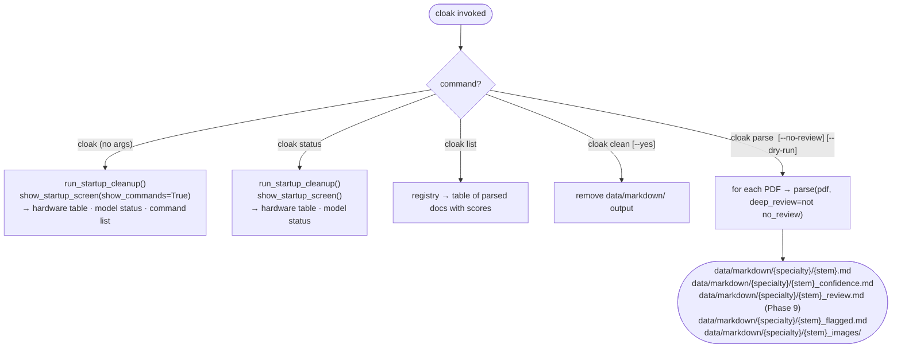
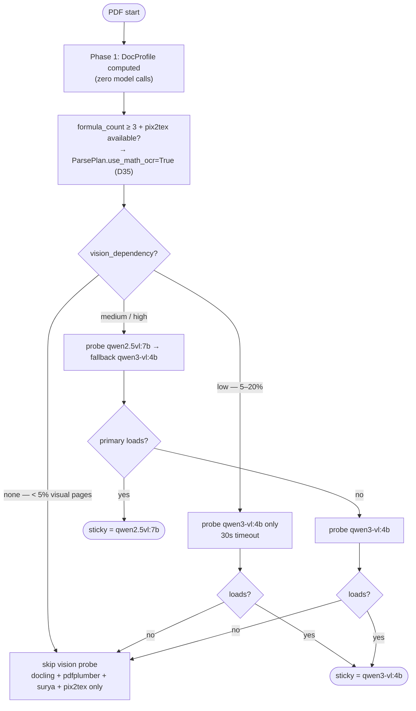
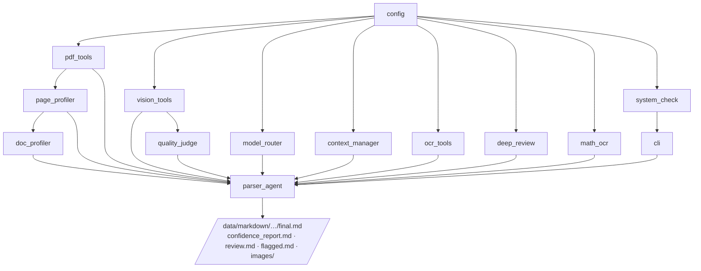

# Architecture — cloak PDF Parser

> Related: [[CLAUDE.md]] · [[docs/MODULES.md]] · [[docs/MODELS.md]] · [[docs/DECISIONS.md]]

General-purpose local PDF → structured markdown. Any document type — research papers, legal, medical, technical manuals, reports, scanned documents, forms, textbooks. No cloud API. No data leaves the machine. See [[docs/DECISIONS.md]] §D16.

---

## CLI startup flow

Startup screen only on bare `cloak` and `cloak status` — not on `parse` or `list`. See D17.



---

## Full pipeline — 9 phases

```mermaid
flowchart TD
    A([PDF file]) --> P0

    subgraph P0["Phase 0 · INTAKE  (no model)"]
        I1["load PDF · count pages\ncreate output dir · create images_dir"]
    end

    P0 --> P1

    subgraph P1["Phase 1 · DOC INTELLIGENCE  (no model)"]
        PR1["docling layout pass → DoclingPageMap\nelements: SectionHeader · Text · Table · Figure\nFormula · Footnote · ListItem · Caption\nPageHeader/PageFooter → DISCARDED\nsort per page by (bbox_norm.y, bbox_norm.x) — D36"]
        PR1 --> PR2["heuristic profile_all(pages) → RouteMap\nupdate_vision_from_docling() — refine needs_vision (D29)"]
        PR2 --> PR2b["build ElementInventory from DoclingPageMap — D47\n{page_n: {headers, tables, figures, formulas}}\nThis is the judge's ground-truth checklist"]
        PR2b --> PR2c["TOC detection → expected_heading_list\ncontinuation table scan → merge_pairs list"]
        PR2c --> PR3["build_doc_profile() → DocProfile\n(page_count · type_distribution · vision_dependency\ncomplexity_score · size_tier · formula_count — D35)"]
        PR3 --> PR4["build_parse_plan() → ParsePlan\n(model_tier · max_rounds · judge_sample_rate\nuse_docling · use_math_ocr · math_ocr_engine — D35)"]
    end

    P1 --> P2

    subgraph P2["Phase 2 · MODEL STAGING  (from ParsePlan.model_tier — D28)"]
        M1["model_tier=none  → skip vision probe"]
        M2["model_tier=fallback → probe qwen3-vl:4b only"]
        M3["model_tier=primary  → probe qwen2.5vl:7b → fallback qwen3-vl:4b"]
    end

    P2 --> P3

    subgraph P3["Phase 3 · EXTRACTION  (docling path primary — D29)"]
        E0["if docling + page not scanned → _extract_docling_page()"]
        E1["SectionHeaderItem → ##/###/#### heading at correct level"]
        E2["TextItem          → pdfplumber chars"]
        E3["TableItem         → pdfplumber (simple) or docling (complex)"]
        E4["FigureItem        → bbox crop → vision.region_describe() + caption"]
        E5["FootnoteItem      → collected → appended at section end"]
        E6["FormulaItem       → pix2tex bbox crop → $$latex$$ (D35)\n                       fallback: docling text as inline code"]
        E7["Scanned page      → surya OCR → tesseract fallback (D30)"]
        E8["Gap A: empty docling output → pdfplumber fallback\nGap C: garbled glyphs → vision reroute"]
    end

    P3 --> P35

    subgraph P35["Phase 3.5 · STRUCTURAL MERGE  (no model — D47)"]
        SM1["merge continuation table pairs (page N + page N+1)\ndetected in Phase 1 — one markdown table, not two fragments"]
        SM1 --> SM2["TOC validation: expected_heading_list vs extracted headings\nmissing headings → targeted_gaps list for Phase 6"]
    end

    P35 --> P4

    subgraph P4["Phase 4 · FORMAT SESSION  (gemma4:26b — once — D20)"]
        F1["structure already correct from docling\nthink=False · FORMAT_NUM_CTX=32768\ncontent-loss guard (D5)"]
    end

    P4 --> P45

    subgraph P45["Phase 4.5 · PRE-JUDGE INVENTORY  (no model — D47)"]
        PJ1["ElementInventory vs extracted markdown\nexpected_tables − found_tables → missing_tables\nexpected_headings − found_headings → missing_headings\n→ pre_gaps list fed directly into Phase 6\nloop knows what is missing before round 1"]
    end

    P45 --> P5

    subgraph P5["Phase 5 · JUDGE SESSION  (4-level escalating — D47)"]
        J1["L1 — Docling Coverage: ElementInventory vs markdown\n     expected vs found per element type · deterministic"]
        J2["L2 — Word Recall + Hallucination Rate: pdfplumber independent\n     recall = (pdfplumber ∩ md) / pdfplumber\n     hallucination = (md − pdfplumber) / md\n     hallucination > 20% → flag regardless of recall"]
        J3["L3 — GLM-OCR Cross-check: only when L1 < 0.7 or L2 hallucination > 0.15\n     independent model · numeric/table discrepancy detection"]
        J4["L4 — Gemma4 Constrained Judge: image_heavy/scanned/exam only\n     prompt grounded with docling checklist · think=True\n     never open-ended self-evaluation"]
        J5["track structural signature per round:\n{heading_count, table_count, paragraph_count}"]
        J1 --> J2 --> J3 --> J4 --> J5
    end

    P5 --> CHK{best_score ≥ 8.0\nor round == plan.max_rounds?}
    CHK -->|no| P6

    subgraph P6["Phase 6 · PATCH SESSION  (gemma4:26b — D47)"]
        PA1["adaptive targeting: sort gaps by severity\ncritical (< 4.0) first · grouped by page proximity\nbatched agent calls — prevents context overflow"]
        PA1 --> PA2["content-loss guard (D5)\nstructural regression check: heading/table count drop > 20% → revert"]
    end

    P6 --> P5

    CHK -->|yes| P7

    subgraph P7["Phase 7 · STRUCTURAL VALIDATION  (no model — D47)"]
        SV1["final_headings vs expected_heading_list\nstill_missing = expected − final\nif still_missing AND budget exhausted:\n  ONE targeted patch for missing sections only"]
    end

    P7 --> P8

    subgraph P8["Phase 8 · WRITE FROM STAGING"]
        O1["assemble from staging file + best_round.markdown"]
    end

    P8 --> P85

    subgraph P85["Phase 8.5 · POST-PROCESS  (deterministic — D47)"]
        PP1["strip_html_comments()     ← processing artifacts G1"]
        PP2["clean_latex_encoding()    ← non-ASCII inside $$...$$ G3"]
        PP3["strip_exam_headers()      ← GATE/IISc/Page X of Y G2"]
        PP4["strip_think_artifacts()   ← /think fragments"]
        PP5["deduplicate_lines()       ← consecutive identical lines"]
        PP6["validate_table_columns()  ← consistent column counts"]
        PP7["add_page_markers()        ← <!-- page N --> between pages"]
        PP8["normalize_whitespace()    ← multiple blank lines → single"]
        PP1 --> PP2 --> PP3 --> PP4 --> PP5 --> PP6 --> PP7 --> PP8
        PP8 --> OUT["write clean final.md\nconfidence_report.md (cites L1/L2/L3/L4 per page)\nflagged.md · images/"]
    end

    P85 --> TD["model_router.teardown_pdf()\nall pipeline models unloaded"]
    TD --> P9

    subgraph P9["Phase 9 · DEEP REVIEW  (gemma4:26b — D27, updated D47)"]
        DR1["input: pdfplumber text + ElementInventory + L1/L2/L3 judge findings\ngrounded prompt: 'docling found X tables — Y appear in markdown'\nverifies specific claims, not open-ended self-review\nwrite {stem}_review.md"]
    end
```



---

## Phase-based model routing (D14, D37)

```mermaid
sequenceDiagram
    participant A as parser_agent
    participant R as model_router
    participant V1 as qwen2.5vl:7b
    participant V2 as qwen3-vl:4b
    participant O as qwen3.6:27b

    A->>R: reset()
    Note over A,O: Phase 3 — docling extraction; vision only for FigureItems + image/mixed pages
    A->>R: before_vision_phase()
    A->>V1: region_describe() for FigureItems (or V2 if sticky)
    A->>R: before_orchestrator_phase() [only if needs_fmt=True — D37]
    A->>O: Phase 4 FORMAT session

    loop Rounds 1..ParsePlan.max_rounds (Phases 5–6)
        Note over A,O: Phase 5 — judge: heuristic (text) or vision (image/scanned)
        A->>R: before_vision_phase()
        A->>V1: judge_quality() for image/scanned pages (or V2 if sticky)
        A->>R: before_orchestrator_phase()
        A->>O: Phase 6 PATCH session
    end

    A->>R: teardown_pdf()
    R->>V1: unload [or V2 if sticky]
    Note over A,O: Phase 9 — deep review (after teardown)
    A->>A: deep_review.run() → gemma4:latest (CPU+GPU split)
```

---

## VRAM budget by phase (RTX 5050, 8 GB VRAM + 24 GB RAM)

| Phase | qwen2.5vl:7b sticky | qwen3-vl:4b sticky |
|---|---|---|
| **Phase 3 EXTRACT** | V1 ~7.3 GB GPU · O ~17 GB CPU+GPU (Ollama manages split) | V2 ~3.5 GB GPU · O ~17 GB CPU+GPU |
| **Phase 4 FORMAT** | O ~17 GB CPU+GPU | O ~17 GB CPU+GPU |
| **Phase 5 JUDGE** | V1 ~7.3 GB GPU · O ~17 GB CPU+GPU | V2 ~3.5 GB GPU · O ~17 GB CPU+GPU |
| **Phase 6 PATCH** | O ~17 GB CPU+GPU | O ~17 GB CPU+GPU |
| **Teardown** | V1 unloaded | V2 unloaded |
| **Phase 9 REVIEW** | gemma4 ~9.6 GB CPU+GPU split (after teardown) | same |

---

## DocProfile-driven model routing (D28)



---

## Extract strategy per page type (Phase 3)

The docling path is the primary route for all non-scanned pages. Legacy vision-only routes used only when docling is unavailable.

```mermaid
flowchart LR
    A([page N]) --> DC{DoclingPageMap\navailable?}

    DC -->|yes + not scanned| DOC["_extract_docling_page()\n→ heading hierarchy from SectionHeaderItems\n→ pdfplumber text for TextItems\n→ vision crop for FigureItems\n→ pix2tex crop for FormulaItems (D35)\n→ footnotes at section end"]
    DC -->|no or scanned| B{RouteMap + vision?}

    B -->|scanned| G["_extract_scanned_page()\nsurya OCR → tesseract fallback"]
    B -->|image_heavy + vision| H["_extract_vision_page()"]
    B -->|mixed + vision| I["_extract_mixed_page()"]
    B -->|text_rich/table_heavy| J["_extract_text_page()"]

    DOC --> FallbackA["Gap A: empty → _extract_text_page()"]
    DOC --> FallbackC["Gap C: garbled → _extract_vision_page()"]

    DOC --> L([raw_content[N]])
    FallbackA --> L
    FallbackC --> L
    G --> L
    H --> L
    I --> L
    J --> L
```

---

## Quality loop — pseudocode

```python
# Phase 0 — Intake
pages = pdf_tools.load_pages(pdf_path)
images_dir = _images_dir(out_path)

# Phase 1 — Doc intelligence
element_map = run_docling_pass(pdf_path)           # None if docling fails
page_profiles = page_profiler.profile_all(pages)
route_map = page_profiler.build_route_map(page_profiles)
if element_map:
    update_vision_from_docling(page_profiles, element_map)   # D29
doc_profile = build_doc_profile(page_profiles, element_map) # formula_count — D35
plan = build_parse_plan(doc_profile, primary_viable, use_docling=element_map is not None)
model_router.set_parse_plan(plan)

# Phase 2 — Staging
vision_available = _probe_vision()   # respects plan.model_tier

# Phase 3 — Extraction (docling path primary)
model_router.before_vision_phase()
raw_content = _extract_by_route(pages, route_map, vision_available,
                                images_dir=images_dir,
                                element_map=element_map,
                                use_math_ocr=plan.use_math_ocr)  # D35
_clean_output_artifacts(raw_content)   # leader dots, watermarks

# Phase 4 — Format (once) — D20
if needs_fmt:
    model_router.before_orchestrator_phase()   # D37: only when format runs
    formatted_md = _run_format_session(raw_content)
    if _content_loss_ok(raw_content, formatted_md):
        current_md = formatted_md

best = RoundResult(score=0.0)

for round_num in 1..plan.max_rounds:

    # Phase 5 — Judge (per-page routing — D33)
    model_router.before_vision_phase()
    page_scores = []
    for pg in sampled_pages(plan.judge_sample_rate):
        if needs_vision_map[pg.page_num]:
            score = quality_judge.judge(pg.image, current_md, round_num, model)
        else:
            score = heuristic_judge(pg.page_num, current_md, pg.text)
    avg_score, all_gaps = aggregate(page_scores)

    if avg_score > best.score:
        best = RoundResult(round_num, current_md, avg_score, page_scores)

    if best.score >= QUALITY_THRESHOLD:   # D3
        break

    # Phase 6 — Patch
    model_router.before_orchestrator_phase()
    messages = context_manager.compress_history(messages)   # D6
    updated = _run_patch_loop(pages, current_md, all_gaps, messages, images_dir)
    if _content_loss_ok(current_md, updated):               # D5
        current_md = updated

# Phase 8 — Output
write(best.markdown, out_path)                                        # D2
write(_build_confidence_report(best.page_scores), confidence_path)   # D24
write(_build_flagged(best.page_scores), flagged_path)
model_router.teardown_pdf()

# Phase 9 — Deep review
if deep_review:
    deep_review.run(pdf_path, pages, best.markdown, review_path)      # D27
```

---

## Key data types

```python
# profiling/page_profiler.py
@dataclass
class PageProfile:
    page_num: int
    text_length: int
    image_area_ratio: float
    table_count: int
    page_type: str      # "text_rich" | "table_heavy" | "image_heavy" | "scanned" | "mixed"
    needs_ocr: bool
    needs_vision: bool  # refined by update_vision_from_docling()

RouteMap = dict[int, str]   # page_num → page_type

# profiling/doc_profiler.py
@dataclass
class DocProfile:
    page_count:        int
    type_distribution: dict[str, float]
    vision_dependency: str    # "none" | "low" | "medium" | "high"
    complexity_score:  float  # 0.0–1.0
    size_tier:         str    # "small" | "medium" | "large" | "huge"
    formula_count:     int    # D35: FormulaItem count from docling

@dataclass
class ParsePlan:
    model_tier:        str    # "none" | "fallback" | "primary"
    max_rounds:        int
    judge_sample_rate: float
    use_docling:       bool
    use_math_ocr:      bool   # D35
    math_ocr_engine:   str    # D35: "pix2tex" | "none"

DoclingElement = dataclass(label, text, level, bbox_norm, table_md, caption)
DoclingPageMap = dict[int, list[DoclingElement]]   # {page_num_0indexed: [elements]}

# quality/quality_judge.py
@dataclass
class PageScore:
    page_num:      int
    score:         float   # 0.7×content + 0.3×structure
    confidence:    str     # "High" | "Medium" | "Low"
    gaps:          list[str]
    action:        str     # "accept" | "patch" | "fallback"
    round_num:     int
    model:         str

@dataclass
class RoundResult:
    round_num:   int
    markdown:    str
    score:       float
    page_scores: list[PageScore]
    gaps:        list[str]
```

---

## Module dependency graph



---

## Folder structure

```
cloak/
├── __init__.py
├── config.py
├── registry.py              ← document registry (cloak list)
├── cli/
│   ├── main.py              ← typer CLI
│   └── system_check.py      ← VRAM-aware hardware probe + startup cleanup
├── profiling/
│   ├── page_profiler.py     ← heuristic page classification + RouteMap (D21)
│   └── doc_profiler.py      ← DocProfile + ParsePlan (D28, D35)
├── extraction/
│   ├── pdf_tools.py         ← PDF → PageData; region crop detection
│   ├── ocr_tools.py         ← Surya primary OCR + Tesseract fallback (D30)
│   └── math_ocr.py          ← pix2tex FormulaItem OCR (D35)
├── vision/
│   └── vision_tools.py      ← region_describe, judge_quality (D29, D34)
├── quality/
│   ├── quality_judge.py     ← PageScore, heuristic_judge (D31, D33)
│   └── deep_review.py       ← Phase 9: gemma4:latest post-pipeline review (D27)
├── orchestration/
│   ├── model_router.py      ← ParsePlan-driven model tier selection (D28, D37)
│   ├── context_manager.py   ← history compression (D6)
│   └── parser_agent.py      ← 9-phase orchestrator (D14 + D19 + D20 + D28–D37)
└── ingestion/               ← legacy read-only files
    ├── pdf_extractor.py
    ├── pdf_classifier.py
    ├── vision.py
    └── markdown_builder.py
```

---

## Hardware constraints

| Resource | Budget | Notes |
|---|---|---|
| GPU VRAM | 8 GB (RTX 5050) | qwen2.5vl:7b fills GPU; qwen3.6:27b spills to RAM |
| RAM | 24 GB | qwen3.6:27b ~9 GB RAM; gemma4 ~1.6 GB RAM (Phase 9 after teardown) |
| Phase rule | One model family at a time | enforced by before_vision_phase / before_orchestrator_phase |
| Max tokens per round | 16K | MODEL_NUM_CTX = 16384 |
| Format context | 32K tokens | FORMAT_NUM_CTX = 32768 |
| Image long edge | 1024px | extract + region_describe (MAX_IMAGE_PX) |
| Judge image long edge | 512px | JUDGE_MAX_IMAGE_PX — reduces visual tokens ~4× |
| Min free RAM to start | 9 GB | system_check.ram_gate() — D18 |
| Phase 9 memory | after teardown only | gemma4 requires all pipeline models unloaded |
