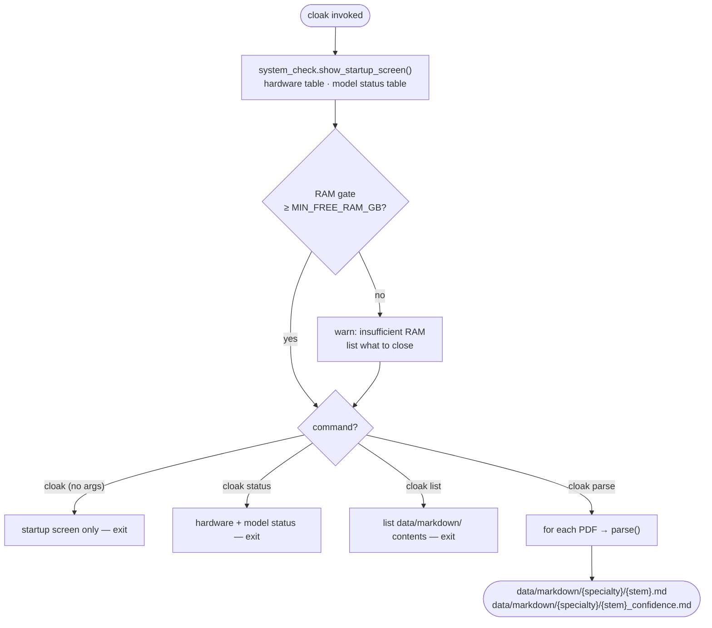
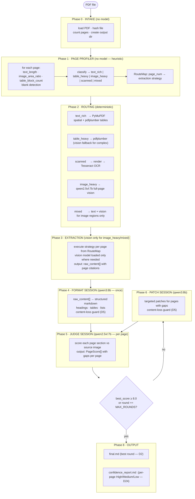
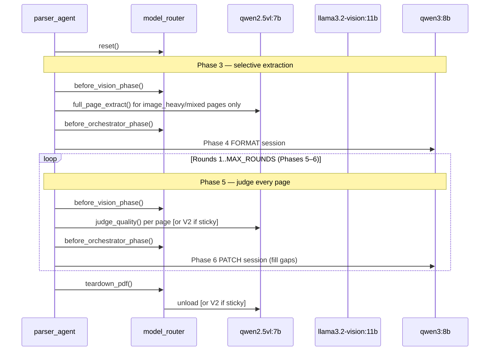
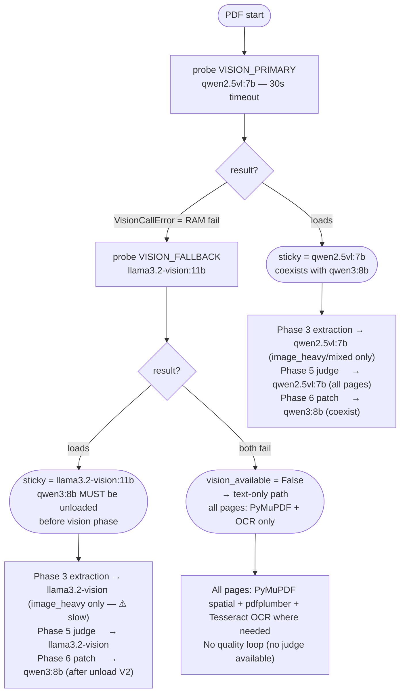
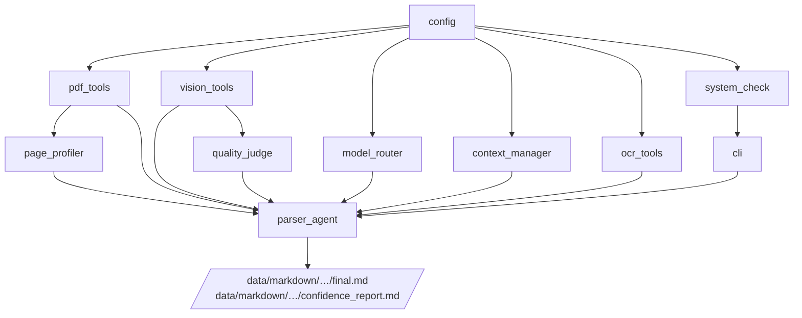

# Architecture — cloak PDF Parser

> Related: [[CLAUDE.md]] · [[docs/MODULES.md]] · [[docs/MODELS.md]] · [[docs/DECISIONS.md]]

General-purpose local PDF → structured markdown. Any document type — research papers, legal, medical, technical manuals, reports, scanned documents, forms, textbooks. No cloud API. No data leaves the machine. See [[docs/DECISIONS.md]] §D16.

---

## CLI startup flow



**CLI commands:**
```
cloak                    → startup screen (hardware + model status)
cloak parse <pdf|dir>    → parse PDF(s), startup screen shown first
cloak status             → hardware + model status only
cloak list               → list parsed documents in data/markdown/
```

See [[docs/MODULES.md]] §CLI · [[docs/DECISIONS.md]] §D17

---

## Full pipeline — 8 phases



---

## Phase-based model routing (D14)

Each quality round (Phases 5–6) splits into two hard phases. Models loaded and unloaded at phase boundary — never mid-round.



---

## VRAM budget by phase

| Phase | qwen2.5vl sticky | llama3.2-vision sticky |
|---|---|---|
| **Phase 3 EXTRACT** (image_heavy only) | V1 ~5 GB GPU · O ~5 GB RAM/GPU (coexist) | V2 ~11 GB GPU+RAM · **O unloaded** |
| **Phase 4 FORMAT** | O ~5 GB GPU · V1 may stay warm | O ~5 GB GPU · **V2 unloaded** |
| **Phase 5 JUDGE** | V1 ~5 GB GPU · O ~5 GB RAM/GPU (coexist) | V2 ~11 GB GPU+RAM · **O unloaded** |
| **Phase 6 PATCH** | O ~5 GB GPU | O ~5 GB GPU |
| **Teardown** | V1 unloaded | V2 unloaded |

Hardware envelope: RTX 5050 8 GB VRAM + 24 GB RAM. See [[docs/MODELS.md]] §VRAM observations.

---

## Model routing decision tree



---

## Extract strategy per page type (Phase 3)

Routing is set by the profiler (Phase 1). No mid-loop model switching.

```mermaid
flowchart LR
    A([page N]) --> B{RouteMap\nstrategy?}

    B -->|text_rich| C["PyMuPDF spatial sort\n+ pdfplumber tables\n→ raw text markdown"]
    B -->|table_heavy| D["pdfplumber tables\nif pdfplumber fails: → vision fallback\n→ raw table markdown"]
    B -->|scanned| E["render page image\n→ Tesseract OCR\n→ raw text"]
    B -->|image_heavy| F["qwen2.5vl:7b full-page vision\n→ markdown directly"]
    B -->|mixed| G["PyMuPDF text blocks\n+ vision for image regions only\n→ combined markdown"]

    C --> H([raw_content[N]])
    D --> H
    E --> H
    F --> H
    G --> H
```

---

## Quality loop — pseudocode (8-phase pipeline)

Reflects D14 (phase-based), D19 (extract once), D20 (FORMAT before PATCH), D21 (profiler routes extraction), D23 (selective vision).

```python
# Phase 0 — Intake
pages = pdf_tools.load_pages(pdf_path)
output_dir = create_output_dir(pdf_path)

# Phase 1 — Page profiler
page_profiles = page_profiler.profile_all(pages)
route_map = page_profiler.build_route_map(page_profiles)

# Phase 2 — Routing (implicit in route_map)

# Phase 3 — Selective extraction
model_router.reset()
_vision_available = _probe_vision()

model_router.before_vision_phase()
raw_content = _extract_by_route(pages, route_map, vision_available=_vision_available)
model_router.before_orchestrator_phase()

# Phase 4 — Format (once) — single qwen3:8b completion, no tools
formatted_md = _run_format_session(raw_content)
if _content_loss_ok(raw_content, formatted_md):        # D5
    current_md = formatted_md

best = RoundResult(score=0.0)

for round_num in 1..MAX_ROUNDS:

    # Phase 5 — Judge (per page, every round)
    model_router.before_vision_phase()
    page_scores = [quality_judge.judge(pg.image, current_md, round_num,
                       model=model_router.get_vision_model()) for pg in pages]
    avg_score, all_gaps = aggregate(page_scores)

    if avg_score > best.score:
        best = RoundResult(round_num, current_md, avg_score, page_scores)

    if best.score >= QUALITY_THRESHOLD:   # D3
        break
    if round_num == MAX_ROUNDS:
        break

    # Phase 6 — Patch
    model_router.before_orchestrator_phase()
    messages = context_manager.compress_history(messages)   # D6
    updated = _run_patch_loop(pages, current_md, all_gaps, messages)
    if _content_loss_ok(current_md, updated):               # D5
        current_md = updated

# Phase 8 — Output
write(best.markdown, output_dir / f"{stem}.md")                              # D2
write(_build_confidence_report(best.page_scores, pdf_name),
      output_dir / f"{stem}_confidence.md")                                  # D24
model_router.teardown_pdf()
```

---

## Module dependency graph



---

## Key data types

```python
# profiling/page_profiler.py
@dataclass
class PageProfile:
    page_num: int
    text_length: int          # chars from PyMuPDF
    image_area_ratio: float   # image bbox area / page area
    table_count: int           # pdfplumber tables found on this page
    page_type: str            # "text_rich" | "table_heavy" | "image_heavy" | "scanned" | "mixed"
    needs_ocr: bool
    needs_vision: bool

RouteMap = dict[int, str]     # page_num → "text_rich" | "table_heavy" | "image_heavy" | "scanned" | "mixed"

# quality/quality_judge.py
@dataclass
class PageScore:
    page_num: int
    score: float              # 0.0 – 10.0
    confidence: str           # "High" (≥8.0) | "Medium" (≥5.0) | "Low" (<5.0)
    gaps: list[str]
    action: str               # "accept" | "patch" | "fallback"
    round_num: int
    model: str

# parser_agent.py — internal tracking
@dataclass
class RoundResult:
    round_num: int
    markdown: str
    score: float
    page_scores: list[PageScore]
    gaps: list[str]

# pdf_tools.py — unchanged
@dataclass
class PageData:
    page_num: int
    image: PIL.Image
    width: float
    height: float
    blocks: list[Block]
    regions: list[RegionCrop]
    tables: list[TableData]
```

---

## File I/O

| Input | Path |
|---|---|
| Source PDFs | `data/raw/{specialty}/{condition}.pdf` |
| Output markdown | `data/markdown/{specialty}/{condition}.md` |
| Output confidence report | `data/markdown/{specialty}/{stem}_confidence.md` |
| Page images | In-memory (PIL) — not written to disk |
| Region crops | In-memory only |

---

## Folder structure (post-restructure — D26)

```
cloak/
├── __init__.py
├── config.py
├── cli/
│   ├── __init__.py
│   ├── main.py              ← typer CLI
│   └── system_check.py      ← hardware probe + startup display
├── profiling/
│   ├── __init__.py
│   └── page_profiler.py     ← NEW: heuristic page classification + RouteMap
├── extraction/
│   ├── __init__.py
│   ├── pdf_tools.py         ← moved from ingestion/
│   └── ocr_tools.py         ← NEW: Tesseract OCR wrapper
├── vision/
│   ├── __init__.py
│   └── vision_tools.py      ← moved from ingestion/
├── quality/
│   ├── __init__.py
│   └── quality_judge.py     ← moved from ingestion/
├── orchestration/
│   ├── __init__.py
│   ├── model_router.py      ← moved from ingestion/
│   ├── context_manager.py   ← moved from ingestion/
│   └── parser_agent.py      ← moved + refactored to 8-phase orchestrator
└── ingestion/               ← legacy read-only files only
    ├── pdf_extractor.py
    ├── pdf_classifier.py
    ├── vision.py
    └── markdown_builder.py
```

---

## Hardware constraints

| Resource | Budget | Notes |
|---|---|---|
| GPU VRAM | 8 GB (RTX 5050) | qwen2.5vl:7b + qwen3:8b coexist (~10 GB, spills to RAM) |
| RAM | 24 GB | llama3.2-vision:11b (11 GB) consumes most when loaded |
| Phase rule | One heavy model at a time | enforced by before_vision_phase / before_orchestrator_phase |
| Max tokens per round | 8K | enforced by context_manager |
| Image long edge | 1024px | enforced by vision_tools._prepare_image |
| Min free RAM to start | 9 GB | checked by system_check.ram_gate() — see [[docs/DECISIONS.md]] §D18 |
