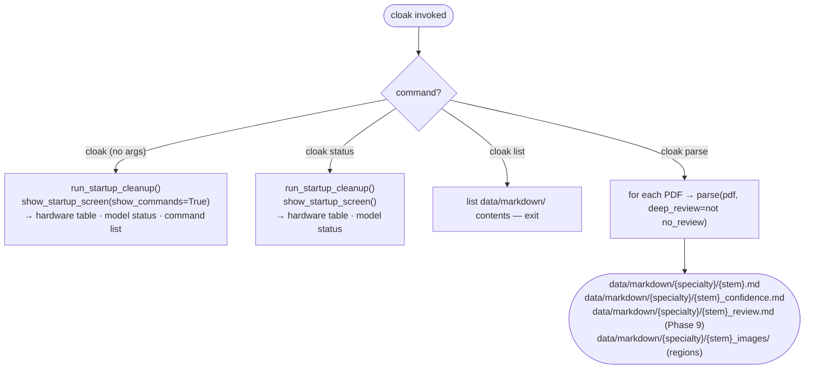
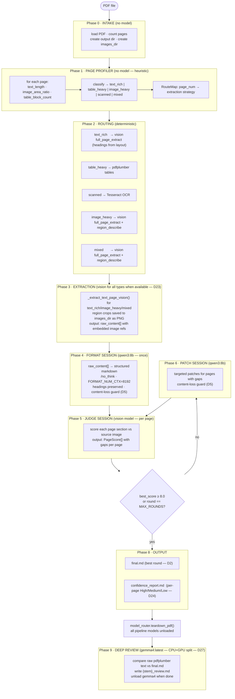
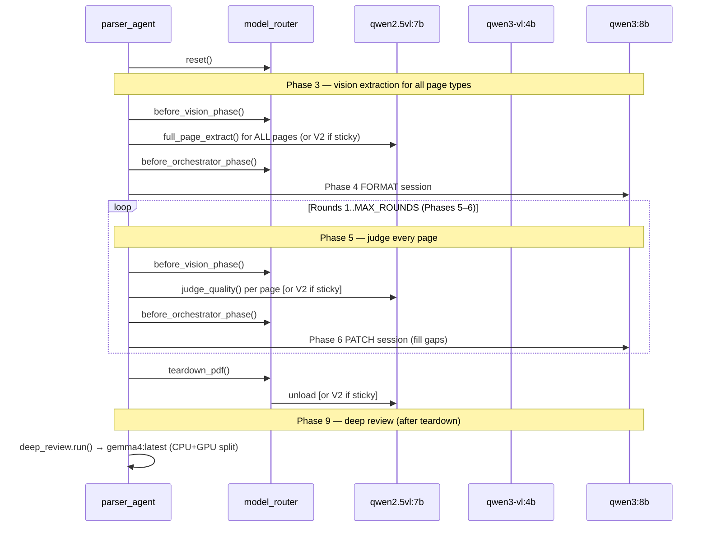
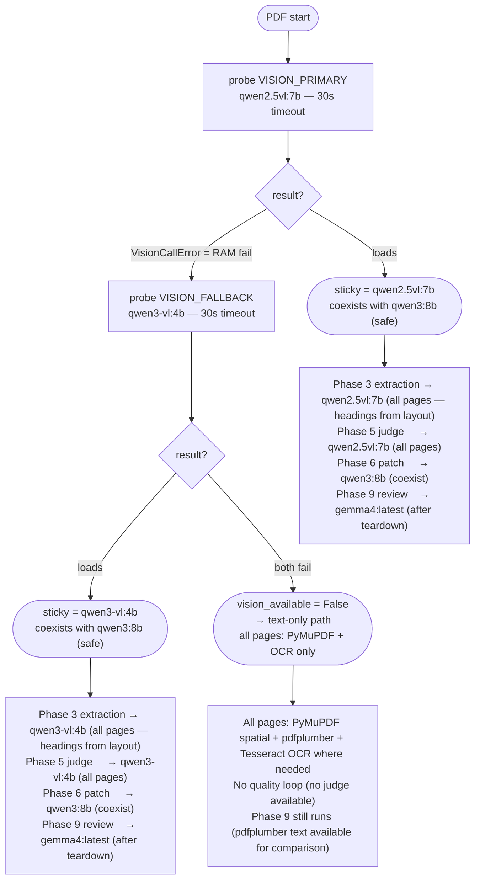
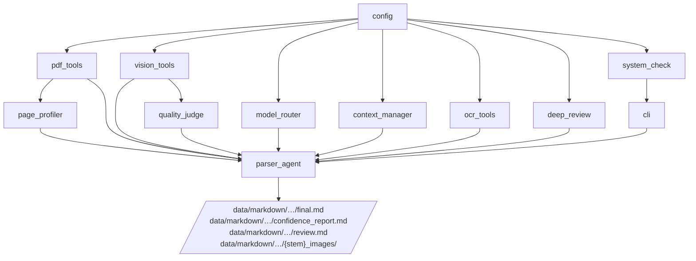

# Architecture — cloak PDF Parser

> Related: [[CLAUDE.md]] · [[docs/MODULES.md]] · [[docs/MODELS.md]] · [[docs/DECISIONS.md]]

General-purpose local PDF → structured markdown. Any document type — research papers, legal, medical, technical manuals, reports, scanned documents, forms, textbooks. No cloud API. No data leaves the machine. See [[docs/DECISIONS.md]] §D16.

---

## CLI startup flow

Startup screen is shown **only** on bare `cloak` and `cloak status` — not on `parse` or `list`. See D17.



**CLI commands:**
```
cloak                               → startup screen (hardware + model status + command list)
cloak parse <pdf|dir>               → parse PDF(s); no startup screen
cloak parse <pdf|dir> --no-review   → parse without Phase 9 deep review
cloak status                        → hardware + model status only
cloak list                          → list parsed documents in data/markdown/
```

See [[docs/MODULES.md]] §CLI · [[docs/DECISIONS.md]] §D17

---

## Full pipeline — 9 phases



---

## Phase-based model routing (D14)

Each quality round (Phases 5–6) splits into two hard phases. Models managed at phase boundary — never mid-round. With `qwen3-vl:4b` as fallback (Session 8), both vision models coexist freely with `qwen3:8b` — phase boundaries are still called structurally but are no-ops for all current model pairings.



---

## VRAM budget by phase

Session 8: all three pipeline models fit in 8 GB VRAM simultaneously. No coexistence conflicts.

| Phase | qwen2.5vl:7b sticky | qwen3-vl:4b sticky |
|---|---|---|
| **Phase 3 EXTRACT** (all page types) | V1 ~7.3 GB GPU · O ~5.2 GB GPU (coexist) | V2 ~3.5 GB GPU · O ~5.2 GB GPU (coexist) |
| **Phase 4 FORMAT** | O ~5.2 GB GPU | O ~5.2 GB GPU |
| **Phase 5 JUDGE** | V1 ~7.3 GB GPU · O ~5.2 GB GPU (coexist) | V2 ~3.5 GB GPU · O ~5.2 GB GPU (coexist) |
| **Phase 6 PATCH** | O ~5.2 GB GPU | O ~5.2 GB GPU |
| **Teardown** | V1 unloaded | V2 unloaded |
| **Phase 9 REVIEW** | gemma4 ~9.6 GB CPU+GPU split (after teardown, no pipeline models loaded) | same |

Hardware envelope: RTX 5050 8 GB VRAM + 24 GB RAM. See [[docs/MODELS.md]] §VRAM observations.

---

## Model routing decision tree



---

## Extract strategy per page type (Phase 3)

Routing is set by the profiler (Phase 1). Session 8: text_rich pages now use vision for heading extraction (D23 updated).

```mermaid
flowchart LR
    A([page N]) --> B{vision\navailable?}

    B -->|yes| C{RouteMap\nstrategy?}
    B -->|no| D{RouteMap\nstrategy?}

    C -->|text_rich| E["_extract_text_page_vision()\nfull_page_extract → headings from layout\n+ pdfplumber tables appended"]
    C -->|table_heavy| F["_extract_table_page()\npdfplumber tables + PyMuPDF text"]
    C -->|scanned| G["_extract_scanned_page()\nTesseract OCR"]
    C -->|image_heavy| H["_extract_vision_page()\nfull_page_extract + region_describe\ncrops saved to images_dir"]
    C -->|mixed| I["_extract_mixed_page()\nfull_page_extract + region_describe\ncrops saved to images_dir"]

    D -->|text_rich/table_heavy| J["_extract_text_page()\npdfplumber flat text + tables"]
    D -->|scanned| G
    D -->|image_heavy/mixed| K["_extract_text_page()\npdfplumber only (no vision available)"]

    E --> L([raw_content[N]])
    F --> L
    G --> L
    H --> L
    I --> L
    J --> L
    K --> L
```

---

## Quality loop — pseudocode (9-phase pipeline)

Reflects D14 (phase-based), D19 (extract once), D20 (FORMAT before PATCH), D21 (profiler routes extraction), D23 (vision for all page types), D27 (Phase 9 deep review).

```python
# Phase 0 — Intake
pages = pdf_tools.load_pages(pdf_path)
output_dir = create_output_dir(pdf_path)
images_dir = _images_dir(out_path)

# Phase 1 — Page profiler
page_profiles = page_profiler.profile_all(pages)
route_map = page_profiler.build_route_map(page_profiles)

# Phase 2 — Routing (implicit in route_map)

# Phase 3 — Vision extraction for all page types (D23 updated)
model_router.reset()
_vision_available = _probe_vision()

model_router.before_vision_phase()
raw_content = _extract_by_route(pages, route_map, images_dir=images_dir)
    # text_rich: _extract_text_page_vision() — headings from visual layout
    # image_heavy/mixed: vision + region_describe + save crops
    # table_heavy: pdfplumber; scanned: Tesseract
model_router.before_orchestrator_phase()

# Phase 4 — Format (once) — qwen3:8b with /no_think, FORMAT_NUM_CTX=8192
formatted_md = _run_format_session(raw_content)
if _content_loss_ok(raw_content, formatted_md):        # D5
    current_md = formatted_md

best = RoundResult(score=0.0)

for round_num in 1..MAX_ROUNDS:

    # Phase 5 — Judge (per page, every round)
    model_router.before_vision_phase()
    page_scores = [quality_judge.judge(pg.image, current_md, round_num,
                       model=model_router.get_vision_model()) for pg in pages]
    avg_score, all_gaps = aggregate(page_scores)

    if avg_score > best.score:
        best = RoundResult(round_num, current_md, avg_score, page_scores)

    if best.score >= QUALITY_THRESHOLD:   # D3
        break
    if round_num == MAX_ROUNDS:
        break

    # Phase 6 — Patch
    model_router.before_orchestrator_phase()
    messages = context_manager.compress_history(messages)   # D6
    updated = _run_patch_loop(pages, current_md, all_gaps, messages, images_dir=images_dir)
    if _content_loss_ok(current_md, updated):               # D5
        current_md = updated

# Phase 8 — Output
write(best.markdown, output_dir / f"{stem}.md")                              # D2
write(_build_confidence_report(best.page_scores, pdf_name),
      output_dir / f"{stem}_confidence.md")                                  # D24
model_router.teardown_pdf()

# Phase 9 — Deep review (after all pipeline models unloaded)
if deep_review:
    rev_path = deep_review.run(pdf_path, pages, best.markdown,
                               review_out=out_path.with_name(f"{stem}_review.md"),
                               console=console)                               # D27
```

---

## Module dependency graph



---

## Key data types

```python
# profiling/page_profiler.py
@dataclass
class PageProfile:
    page_num: int
    text_length: int          # chars from PyMuPDF
    image_area_ratio: float   # image bbox area / page area
    table_count: int           # pdfplumber tables found on this page
    page_type: str            # "text_rich" | "table_heavy" | "image_heavy" | "scanned" | "mixed"
    needs_ocr: bool
    needs_vision: bool

RouteMap = dict[int, str]     # page_num → "text_rich" | "table_heavy" | "image_heavy" | "scanned" | "mixed"

# quality/quality_judge.py
@dataclass
class PageScore:
    page_num: int
    score: float              # 0.0 – 10.0
    confidence: str           # "High" (≥8.0) | "Medium" (≥5.0) | "Low" (<5.0)
    gaps: list[str]
    action: str               # "accept" | "patch" | "fallback"
    round_num: int
    model: str

# parser_agent.py — internal tracking
@dataclass
class RoundResult:
    round_num: int
    markdown: str
    score: float
    page_scores: list[PageScore]
    gaps: list[str]

# pdf_tools.py — unchanged
@dataclass
class PageData:
    page_num: int
    image: PIL.Image
    width: float
    height: float
    blocks: list[Block]
    regions: list[RegionCrop]
    tables: list[TableData]
```

---

## File I/O

| Input | Path |
|---|---|
| Source PDFs | `data/raw/{specialty}/{condition}.pdf` |
| Output markdown | `data/markdown/{specialty}/{condition}.md` |
| Output confidence report | `data/markdown/{specialty}/{stem}_confidence.md` |
| Output deep review | `data/markdown/{specialty}/{stem}_review.md` (Phase 9, optional) |
| Region crop images | `data/markdown/{specialty}/{stem}_images/page_{n}_{label}_{i}.png` |
| Page images | In-memory (PIL) — not written to disk |

---

## Folder structure (post-restructure — D26, updated Session 8)

```
cloak/
├── __init__.py
├── config.py
├── cli/
│   ├── __init__.py
│   ├── main.py              ← typer CLI (startup screen only on bare cloak + status)
│   └── system_check.py      ← VRAM-aware hardware probe + startup memory cleanup
├── profiling/
│   ├── __init__.py
│   └── page_profiler.py     ← heuristic page classification + RouteMap
├── extraction/
│   ├── __init__.py
│   ├── pdf_tools.py         ← PDF → PageData; region crop detection
│   └── ocr_tools.py         ← Tesseract OCR wrapper
├── vision/
│   ├── __init__.py
│   └── vision_tools.py      ← full_page_extract, region_describe, judge_quality
├── quality/
│   ├── __init__.py
│   ├── quality_judge.py     ← PageScore, per-page confidence
│   └── deep_review.py       ← Phase 9: gemma4:latest post-pipeline review
├── orchestration/
│   ├── __init__.py
│   ├── model_router.py      ← phase-based VRAM-aware model management
│   ├── context_manager.py   ← history compression
│   └── parser_agent.py      ← 9-phase orchestrator
└── ingestion/               ← legacy read-only files only
    ├── pdf_extractor.py
    ├── pdf_classifier.py
    ├── vision.py
    └── markdown_builder.py
```

---

## Hardware constraints

| Resource | Budget | Notes |
|---|---|---|
| GPU VRAM | 8 GB (RTX 5050) | qwen2.5vl:7b (7.3 GB) + qwen3:8b (5.2 GB) — may spill ~4 GB to RAM |
| RAM | 24 GB | gemma4:latest (9.6 GB) used in Phase 9 via CPU+GPU split |
| Phase rule | One model family at a time | enforced by before_vision_phase / before_orchestrator_phase |
| Max tokens per round | 8K | enforced by context_manager |
| Format context | 8192 tokens | FORMAT_NUM_CTX — larger to handle vision output + thinking tokens |
| Image long edge | 1024px | enforced by vision_tools._prepare_image |
| Min free RAM to start | 9 GB | checked by system_check.ram_gate() — see [[docs/DECISIONS.md]] §D18 |
| Phase 9 memory | loaded after teardown | gemma4 requires all pipeline models unloaded first |
